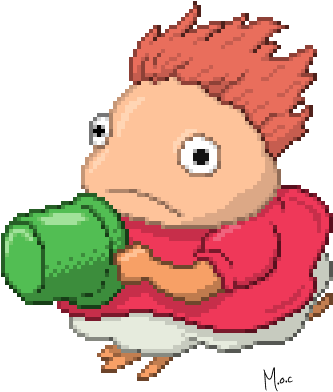

Hi, I'm Emre, a full-stack developer based in Berlin, originally from Istanbul. I build products end to end, from cloud architecture to pixel, guided by one motto: make reality better with a piece of code.

Most of my energy goes into [Nutrivine](https://nutrivine.app), an AI nutrition app that thousands of people use to eat better every day. It's on the [App Store](https://apps.apple.com/us/app/nutrivine-ai-calorie-tracker/id6753625715) and [Google Play](https://play.google.com/store/apps/details?id=com.nutrivine).

Away from the keyboard you'll find me running or biking, playing blues on my electric guitar, or sharing beers and good conversations with friends.

  <a href="https://emre-yalcin.de">Portfolio</a> · <a href="https://emre-yalcin.de/cv">CV</a> · <a href="https://www.linkedin.com/in/m-emre-yalcin/">LinkedIn</a> · <a href="mailto:emrreyalcin@gmail.com">emrreyalcin@gmail.com</a>

  

